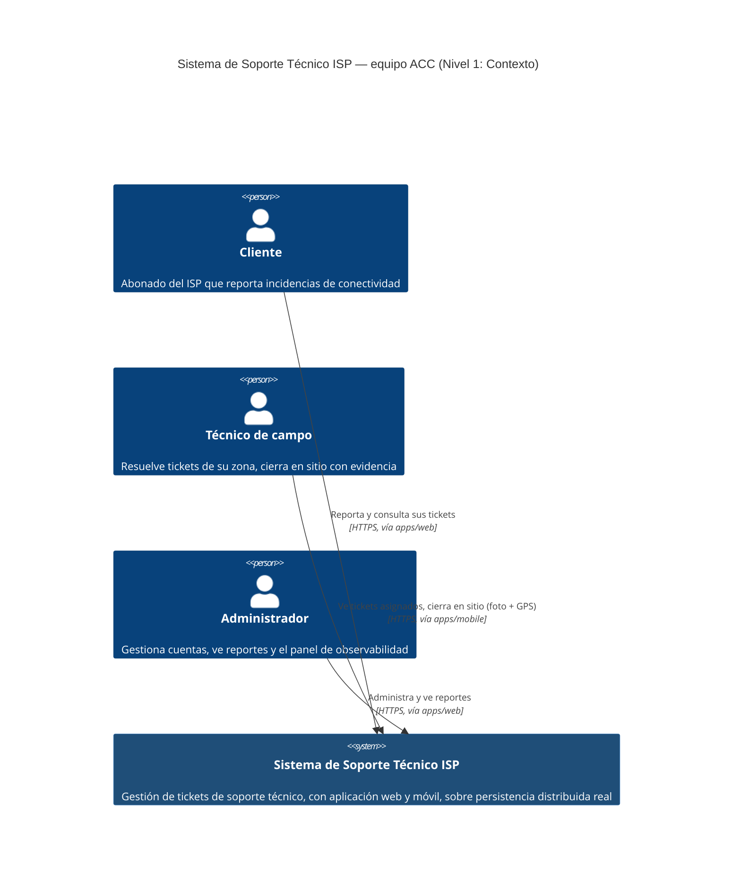

# C4 Nivel 1 — Diagrama de contexto del sistema

Equipo ACC — Soporte Técnico ISP. Vista de más alto nivel: el sistema como una sola caja, sus
usuarios, y por qué no hay sistemas externos reales que integrar (todo lo que podría parecer
externo — notificaciones multicanal, telemetría de equipos del abonado — está simulado
internamente, documentado como tal en cada ADR correspondiente, no oculto detrás de una
integración real). Este archivo renderiza el diagrama directamente en GitHub (bloque Mermaid) —
para incluirlo en el documento LaTeX, exportar como PNG desde
[mermaid.live](https://mermaid.live) pegando el bloque de abajo.

## Por qué no hay sistemas externos en este nivel

- Las **notificaciones multicanal** (`notification-service`) están explícitamente simuladas —
  no hay integración real con un proveedor de SMS/email/push (ver el propio código:
  `dispatcher.js` genera el contenido y lo guarda en Mongo, no lo envía a ningún servicio
  externo).
- La **telemetría de equipos del abonado y latidos de nodo** (PE-U1, `telemetry-service`) es un
  canal simulado dentro del propio sistema (ver ADR-0007), no una integración con hardware real
  de campo.
- El **clúster CockroachDB**, Kafka y MongoDB son parte de la infraestructura propia del sistema
  (nivel 2), no sistemas externos de terceros.
