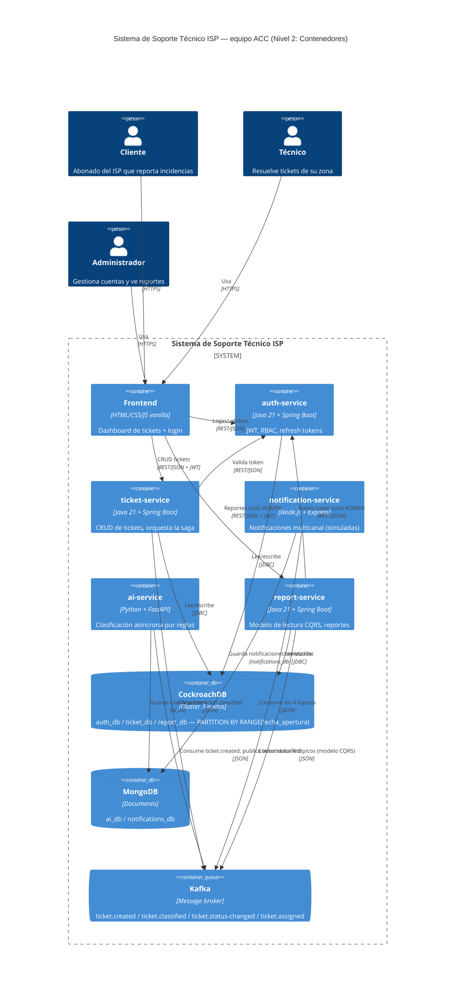

# C4 Nivel 2 — Diagrama de contenedores

Equipo ACC — Soporte Técnico ISP. Refleja el estado real del sistema tras la Entrega 3 (5
microservicios, cluster CockroachDB de 3 nodos particionado por `fecha_apertura`, Kafka + MongoDB
para la saga por coreografía). Este archivo renderiza el diagrama directamente en GitHub (bloque
Mermaid) — para incluirlo en el documento LaTeX, exportar como PNG desde
[mermaid.live](https://mermaid.live) pegando el bloque de abajo.

