# C4 Nivel 3 — Componentes de `ticket-service`

Zoom al único servicio con arquitectura hexagonal completa (4 capas, 6 patrones GoF, ver
[ADR-0005](../adr/0005-patrones-gof.md) y la Sección de arquitectura del manuscrito). Cada caja de
este diagrama es una clase real del árbol —no una agrupación aproximada—: los nombres coinciden
exactamente con `services/svc-principal/src/main/java/.../ticketservice/`. Este archivo renderiza
el diagrama directamente en GitHub (bloque Mermaid) — para incluirlo en el documento LaTeX,
exportar como PNG desde [mermaid.live](https://mermaid.live) pegando el bloque de abajo.

```mermaid
C4Component
    title ticket-service — Vista de componentes (Nivel 3, Entrega 4)

    Container(gateway, "api-gateway", "Spring Cloud Gateway", "Enruta /api/v1/tickets/** aquí")
    Container(authService, "auth-service", "Java 21", "Valida el access token")
    ContainerDb(crdb, "CockroachDB", "ticket_db", "3 nodos, PARTITION BY RANGE(created_at)")
    ContainerQueue(kafka, "Kafka", "Message broker", "ticket.* / technician.created")
    Container(telemetryService, "telemetry-service", "gRPC", "Eventos de zona (PE-U1)")

    Container_Boundary(ticketService, "ticket-service (Java 21 + Spring Boot, 4 capas)") {

        Container_Boundary(presentation, "presentation") {
            Component(authFilter, "AuthGatewayFilter", "Servlet Filter (infrastructure/security)", "Valida el token contra auth-service; puebla authUserId/authRole/authZone")
            Component(controller, "TicketController", "REST Controller", "POST/GET/PATCH /api/v1/tickets")
            Component(incController, "IncidenciaController", "REST Controller", "GET .../tickets/incidencias")
            Component(exHandler, "GlobalExceptionHandler", "@ControllerAdvice", "Traduce excepciones de dominio a códigos HTTP")
        }

        Container_Boundary(application, "application (patrón Command)") {
            Component(createH, "CreateTicketHandler", "Command Handler", "Crea el ticket en estado NUEVO")
            Component(statusH, "UpdateTicketStatusHandler", "Command Handler", "Cambia el estado")
            Component(assignH, "AssignTechnicianHandler", "Command Handler", "Asigna técnico")
            Component(queryS, "TicketQueryService", "Application Service", "Consultas filtradas por rol")
            Component(writer, "TicketWriter", "Application Service", "save() con 1 reintento serializable")
            Component(authz, "TicketAuthorization", "Application Service", "Quién puede ver/crear/gestionar")
            Component(correlS, "CorrelationService", "Application Service", "Agrupa el ticket nuevo en una Incidencia")
        }

        Container_Boundary(domain, "domain (puertos + lógica de negocio)") {
            Component(factory, "TicketFactory", "Factory Method", "Crea un Ticket NUEVO válido")
            Component(slaPolicy, "SlaPolicy (puerto)", "Strategy", "DefaultSlaPolicy / ClassifiedSlaPolicy")
            Component(corrStrategy, "CorrelationStrategy (puerto)", "Strategy", "c0 / c1 / c2, elegida por env CORREL")
            Component(escChain, "EscalationChain", "Chain of Responsibility", "2 eslabones: SLA vencido, crítico estancado")
            Component(escObserver, "EscalationObserver (puerto)", "Observer", "3 implementaciones: log, métrica, evento")
            Component(ticketRepoPort, "TicketRepository (puerto)", "Repository", "Persistencia de Ticket, sin JPA")
            Component(incRepoPort, "IncidenciaRepository (puerto)", "Repository", "Persistencia de Incidencia, sin JPA")
            Component(eventPort, "EventPublisher (puerto)", "Port", "Publicar eventos de integración")
            Component(telemetryPort, "TelemetryQueryPort (puerto)", "Port", "Consultar telemetría (solo la usa c2)")
        }

        Container_Boundary(infrastructure, "infrastructure (adaptadores)") {
            Component(repoAdapter, "TicketRepositoryAdapter", "Adapter, JPA", "implements TicketRepository")
            Component(incRepoAdapter, "IncidenciaRepositoryAdapter", "Adapter, JPA", "implements IncidenciaRepository")
            Component(kafkaAdapter, "KafkaEventPublisherAdapter", "Adapter, Kafka", "implements EventPublisher")
            Component(grpcAdapter, "TelemetryGrpcClientAdapter", "Adapter, gRPC", "implements TelemetryQueryPort")
            Component(classifListener, "TicketClassificationListener", "Kafka Consumer", "ticket.classified -> recalcula SLA")
            Component(techListener, "TechnicianSyncListener", "Kafka Consumer", "technician.created -> tabla local (ver nota)")
            Component(scheduler, "EscalationScheduler", "@Scheduled cada 5 min", "Dispara la cadena, notifica a los observadores")
        }
    }

    Rel(gateway, authFilter, "reenvía", "HTTP")
    Rel(authFilter, authService, "valida el token", "HTTP")
    Rel(authFilter, controller, "deja pasar (con authUserId/Role/Zone)")
    Rel(authFilter, incController, "deja pasar")

    Rel(controller, createH, "arma CreateTicketCommand")
    Rel(controller, statusH, "arma UpdateTicketStatusCommand")
    Rel(controller, assignH, "arma AssignTechnicianCommand")
    Rel(controller, queryS, "consulta")
    Rel(incController, incRepoPort, "consulta directo, sin handler")

    Rel(createH, authz, "assertCanCreate")
    Rel(createH, factory, "crearNuevo")
    Rel(createH, writer, "saveWithRetry")
    Rel(createH, eventPort, "publish ticket.created")
    Rel(createH, correlS, "correlacionar")
    Rel(factory, slaPolicy, "slaFor (Default)")
    Rel(correlS, corrStrategy, "agrupar")
    Rel(correlS, incRepoPort, "save / find Incidencia")

    Rel(statusH, ticketRepoPort, "find")
    Rel(statusH, authz, "assertCanManage")
    Rel(statusH, writer, "saveWithRetry")
    Rel(statusH, eventPort, "publish ticket.status-changed")

    Rel(assignH, ticketRepoPort, "find")
    Rel(assignH, authz, "assertCanManage")
    Rel(assignH, writer, "saveWithRetry")
    Rel(assignH, eventPort, "publish ticket.assigned")

    Rel(queryS, ticketRepoPort, "find*")
    Rel(queryS, authz, "assertCanView")
    Rel(writer, ticketRepoPort, "save")

    Rel(classifListener, ticketRepoPort, "find + save, sin pasar por ningún Handler")
    Rel(classifListener, slaPolicy, "slaFor (Classified)")
    Rel(classifListener, kafka, "consume ticket.classified", "Kafka")
    Rel(techListener, kafka, "consume technician.created", "Kafka")

    Rel(scheduler, ticketRepoPort, "lee tickets activos")
    Rel(scheduler, escChain, "handle(ticket)")
    Rel(scheduler, escObserver, "onTicketEscalated, notifica")

    Rel(repoAdapter, ticketRepoPort, "implementa")
    Rel(incRepoAdapter, incRepoPort, "implementa")
    Rel(kafkaAdapter, eventPort, "implementa")
    Rel(grpcAdapter, telemetryPort, "implementa")
    Rel(corrStrategy, telemetryPort, "usa, solo c2")

    Rel(repoAdapter, crdb, "SQL", "Spring Data JPA")
    Rel(incRepoAdapter, crdb, "SQL", "Spring Data JPA")
    Rel(kafkaAdapter, kafka, "publica", "Kafka")
    Rel(grpcAdapter, telemetryService, "GetEventosPorZona", "gRPC")

    UpdateElementStyle(controller, $bgColor="#1F4E78", $fontColor="#ffffff")
    UpdateElementStyle(incController, $bgColor="#1F4E78", $fontColor="#ffffff")
```

## Puntos clave

- **Los 6 patrones GoF de ADR-0005 son visibles en este diagrama, no solo en prosa**: Command
  (`*Handler` implementando `TicketCommandHandler<C,R>`), Factory Method (`TicketFactory`),
  Strategy (`SlaPolicy` y `CorrelationStrategy`, cada una con implementaciones intercambiables),
  Repository (`TicketRepository`/`IncidenciaRepository` como puerto + adaptador JPA), Chain of
  Responsibility (`EscalationChain`) y Observer (`EscalationObserver`).
- **Dos rutas rompen deliberadamente la capa de aplicación**, y está documentado aquí en vez de
  ocultarlo: `IncidenciaController` consulta `IncidenciaRepository` directo (es una lectura
  simple, sin caso de uso que orquestar) y `TicketClassificationListener` opera sobre
  `TicketRepository` sin pasar por ningún `*CommandHandler` (el caso de uso real es "aplicar una
  clasificación asíncrona que llegó por Kafka", no una acción HTTP con autorización de rol).
- **`TechnicianSyncListener` no tiene puerto de dominio**: escribe directo en una tabla de
  sincronización local (`SpringDataTechnicianRepository`) que no representa un concepto de
  dominio propio de `ticket-service` — es una réplica de solo lectura de datos que pertenecen a
  `auth-service`, necesaria únicamente para que `AssignTechnicianHandler` no viole la clave
  foránea `tickets_technician_id_fkey`. Por eso no aparece como puerto en el diagrama.
- **Límite real, no el que publica el manuscrito todavía**: la Tabla "Las cuatro capas" de la
  Sección de arquitectura dice que `domain` tiene "cero anotaciones Spring/JPA". Verificado contra
  el árbol al construir este diagrama: eso es falso — hay 12 líneas `import
  org.springframework.*` en 9 clases de `domain/` (`@Component`, `@Value`, `@Order`, todas para
  que Spring pueda descubrir e inyectar las implementaciones de cada puerto). Ninguna es JPA
  (`jakarta.persistence`), así que el límite de persistencia sí se respeta, pero el de framework
  no. Corregirlo (mover el descubrimiento de beans a `infrastructure` o a clases `@Configuration`
  explícitas) es trabajo pendiente, no resuelto por este diagrama.
