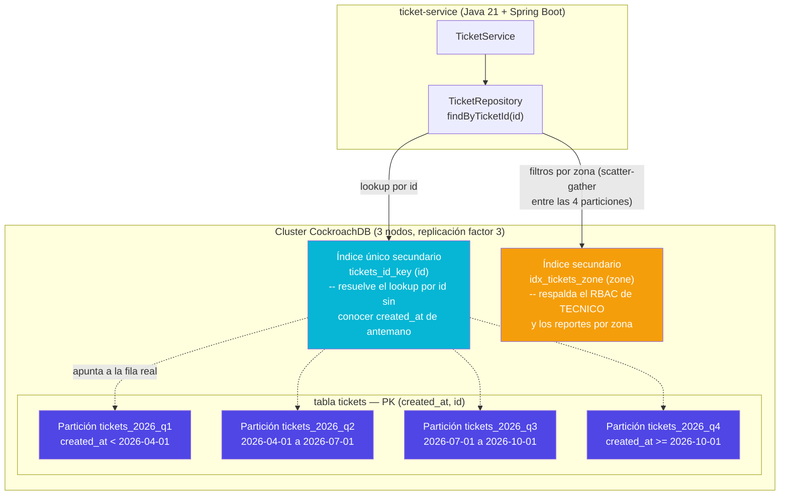

# C4 Nivel 3 — Componentes: partición de `tickets` en CockroachDB

Zoom al cluster CockroachDB (`ticket_service`), mostrando la estrategia real de fragmentación
tras la Entrega 3: **por fecha de apertura** (`PARTITION BY RANGE`), no por zona geográfica — ver
[`docs/adr/0003-sharding-policy.md`](../adr/0003-sharding-policy.md) para la justificación completa
del cambio y sus trade-offs.

**Puntos clave (ver ADR-0003 para el detalle):**

- `zone` ya **no** es la clave de fragmentación — sigue existiendo como columna de negocio real
  (RBAC de TECNICO, reportes), respaldada por un índice secundario normal, no por partición física.
- El punto de acceso más común del sistema (buscar un ticket por `id`) pasa por el índice único
  `tickets_id_key`, no por la clave primaria compuesta directamente.
- Las consultas por rango de fecha (la mayoría de los reportes reales) se resuelven dentro de 1-2
  particiones contiguas; las consultas filtradas por zona ahora cruzan las 4 particiones
  (*scatter-gather*), un trade-off documentado y medido en `db-cluster/scripts/queries_bench.sql`.
