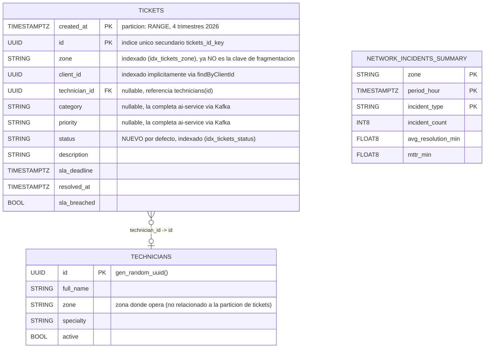

# Esquema de `ticket_db` (CockroachDB, cluster de 3 nodos)

Corresponde a `db-cluster/scripts/init_db.sql`. `tickets` es la tabla de mayor cardinalidad y la
única fragmentada (`PARTITION BY RANGE (created_at)`, ver
[ADR-0003](../adr/0003-sharding-policy.md)); `technicians` es una dimensión pequeña sin
particionar.

## Notas de diseño

- **Colocalización con `clientes`**: la guía de la Entrega 3 pide colocalizar `tickets` con
  `clientes` por `client_id`. Los clientes viven en `auth_db.users`, propiedad de `auth-service`
  — una base de datos física distinta, por diseño de microservicios (cada servicio es dueño de su
  propio esquema). Ver la sección correspondiente del ADR-0003 para la discusión completa de este
  trade-off.
- **`network_incidents_summary`**: tabla de respaldo para materializar el resultado del pipeline
  de Spark (ver `spark/README.md`, sección de integración) — no se llena desde `ticket-service`,
  la llena un job de Spark o un script de materialización aparte.
- El esquema completo de los otros 4 microservicios (`auth_db`, `report_db`, `ai_db`,
  `notifications_db`) vive en sus propios scripts: `db-cluster/scripts/init_auth_db.sql`,
  `db-cluster/scripts/init_report_db.sql`, y las colecciones de MongoDB documentadas en los
  READMEs de `ai-service`/`notification-service` respectivamente.
